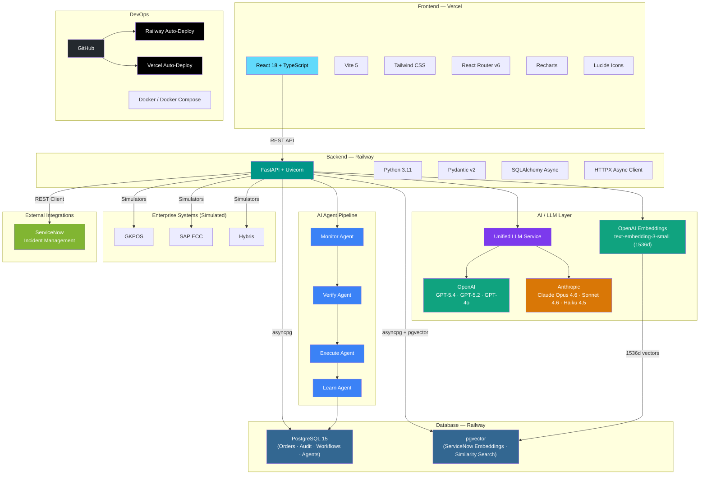

# NEXUS — Technology Architecture

## Architecture Diagram

## Technology Stack

| Layer | Technology |
|-------|-----------|
| **Frontend** | React 18, TypeScript, Vite 5, Tailwind CSS, React Router v6, Recharts |
| **Backend** | Python 3.11, FastAPI, Uvicorn, Pydantic v2, SQLAlchemy Async, HTTPX |
| **Database** | PostgreSQL 15 (asyncpg driver) |
| **Vector DB** | pgvector extension on PostgreSQL (1536-dim embeddings) |
| **LLM — OpenAI** | GPT-5.4, GPT-5.2, GPT-4o, GPT-4o Mini |
| **LLM — Anthropic** | Claude Opus 4.6, Claude Sonnet 4.6, Claude Haiku 4.5 |
| **Embeddings** | OpenAI text-embedding-3-small (1536 dimensions) |
| **AI Agents** | Monitor → Verify → Execute → Learn (direct chain) |
| **Hosting** | Railway (backend + DBs), Vercel (frontend) |
| **CI/CD** | GitHub → Railway/Vercel auto-deploy |
| **Local Dev** | Docker Compose |
| **Integrations** | ServiceNow, GKPOS, SAP ECC, Hybris (simulated) |
