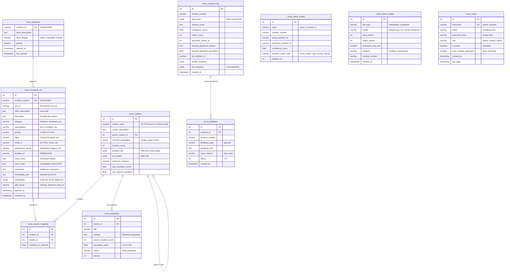
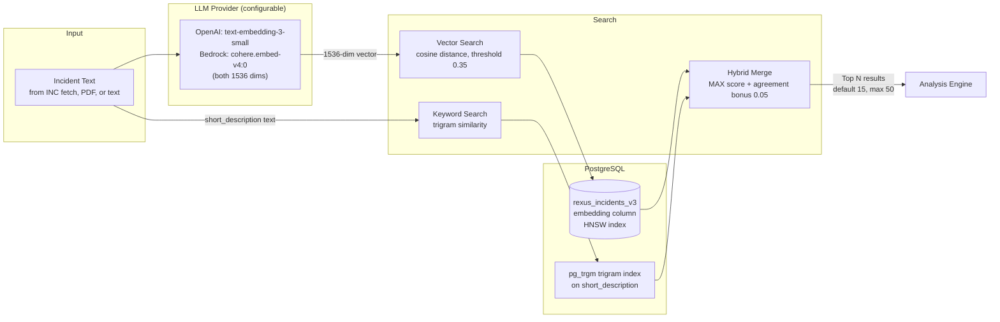
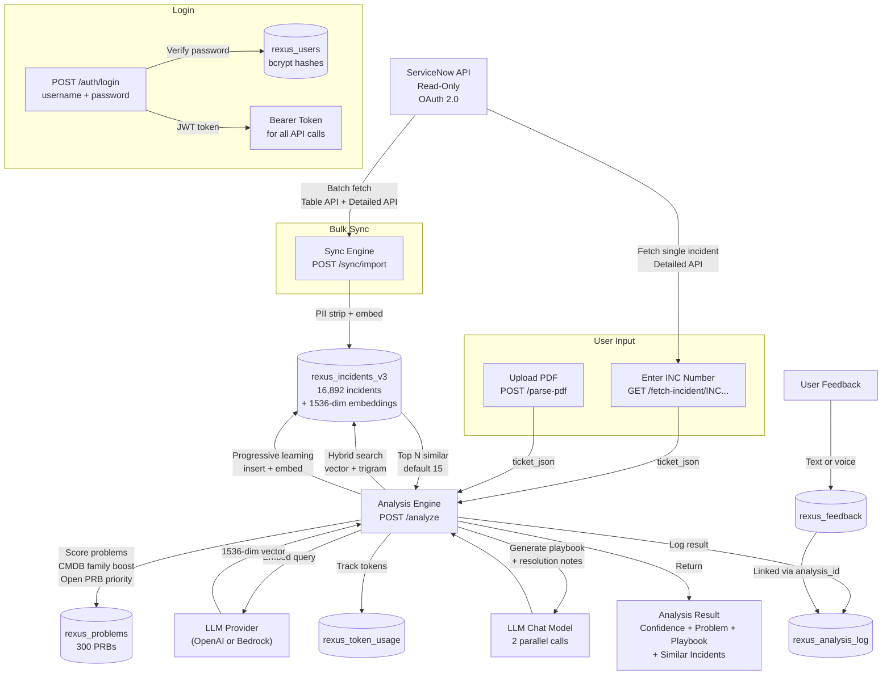

# REX-US — Data Model

## Entity Relationship Diagram

## Table Summary

| Table | Rows | Purpose | Vector Column |
|-------|------|---------|---------------|
| **rexus_incidents_v3** | 16,892 | Production knowledge base — incidents with embeddings | `embedding` (vector 1536, HNSW index) |
| **rexus_clusters** | 2,379 | Incident groups (similar incidents clustered together) | `centroid_embedding` (vector 1536) |
| **rexus_cluster_mapping** | 14,992 | Many-to-many: which incident belongs to which cluster | — |
| **rexus_playbooks** | 0 | Generated resolution playbooks per cluster | — |
| **rexus_analysis_log** | 7,407 | Every analysis ever run — input, output, scores | — |
| **rexus_feedback** | 41 | User feedback (text + voice) linked to analyses | — |
| **rexus_problems** | 300 | ServiceNow Problem records with state (Open/Cancelled) | — |
| **rexus_wave_results** | 1,899 | Validation test results across 5 waves | — |
| **rexus_token_usage** | — | LLM API call tracking for cost monitoring (OpenAI or Bedrock) | — |
| **rexus_users** | — | User accounts for JWT authentication (admin, analyst, viewer roles) | — |

## Vector Search Architecture

**How it works:**
1. User logs in (JWT authentication), then provides an incident via INC number (fetched from ServiceNow), PDF upload, or plain text
2. Incident text is cleaned (PII stripped via regex) and sent to the configured embedding model for vectorization (1536 dimensions). The embedding model is configurable: `text-embedding-3-small` when `LLM_PROVIDER=openai`, or `cohere.embed-v4:0` when `LLM_PROVIDER=bedrock`. Both produce 1536-dimensional vectors.
3. Two parallel searches run against PostgreSQL on the `rexus_incidents_v3` table (only `training` and `analyzed` split groups):
   - **Vector search:** cosine distance using HNSW index on the `embedding` column, threshold = `request.threshold - 0.05` (default 0.35) — finds semantically similar incidents
   - **Keyword search:** PostgreSQL `pg_trgm` trigram similarity on `short_description`, triggered only if the query is longer than 5 characters — finds lexically similar incidents
4. Results are merged per incident: `MAX(vector_score, keyword_score)`. If both methods found the same incident (agreement), a bonus of `min(vec, kw) * 0.05` is added — but only if vector > 0.4 and keyword > 0.3
5. Results are sorted by hybrid score, top N returned (default 15, configurable 1-50 via `limit` parameter)
6. Top results go to the analysis engine for CMDB family-aware problem scoring and GPT-powered playbook generation

## Index Details

| Table | Index | Type | Purpose | Migration |
|-------|-------|------|---------|-----------|
| rexus_incidents_v3 | `embedding_idx` | HNSW (vector_cosine_ops) | Sub-second vector similarity search | 001 |
| rexus_incidents_v3 | `short_description_idx` | GIN (pg_trgm) | Keyword trigram search | 001 |
| rexus_incidents_v3 | `idx_rexus_incidents_v3_trgm` | GIN (gin_trgm_ops) | Trigram similarity for hybrid search | 004 |
| rexus_incidents_v3 | `incident_number_key` | UNIQUE | Fast lookup by INC number | 001 |
| rexus_incidents_v3 | `split_group_idx` | B-tree | Filter training vs analyzed vs wave | 001 |
| rexus_incidents_v3 | `problem_id_idx` | B-tree | Problem suggestion scoring | 001 |
| rexus_incidents_v3 | `cmdb_ci_idx` | B-tree | CMDB family filtering | 001 |
| rexus_incidents_v3 | `opened_at_idx` | B-tree | Chronological ordering | 001 |
| rexus_analysis_log | `created_idx` | B-tree | Analysis history queries | 001 |
| rexus_analysis_log | `idx_analysis_log_incident` | B-tree (partial) | Per-incident analysis lookups | 004 |
| rexus_feedback | `idx_feedback_incident` | B-tree (partial) | Per-incident feedback lookups | 004 |
| rexus_wave_results | `wave_idx` | B-tree | Wave test result queries | 001 |
| rexus_token_usage | `created_idx` | B-tree | Token usage dashboard | 003 |
| rexus_users | `idx_rexus_users_username` | B-tree | Fast username lookup for login | 005 |
| rexus_users | `idx_rexus_users_role` | B-tree | Role-based user queries | 005 |

## Data Flow

## Database Sizing

| Component | Current | At 25K incidents | At 100K incidents |
|-----------|---------|-----------------|-------------------|
| Incidents table | 400 MB | ~600 MB | ~2.4 GB |
| HNSW vector index | ~170 MB | ~250 MB | ~1 GB |
| Trigram index | ~50 MB | ~75 MB | ~300 MB |
| Clusters | ~100 MB | ~150 MB | ~500 MB |
| Analysis logs | ~500 MB | ~1 GB | ~5 GB |
| **Total** | **~1.2 GB** | **~2 GB** | **~9 GB** |

The HNSW index must fit in RAM for optimal performance. At 100K incidents (~1 GB index), a 32 GB RAM database instance has ample headroom.

---

*REX-US v8 | Data Model v2.0 — Auth + LLM provider abstraction*
