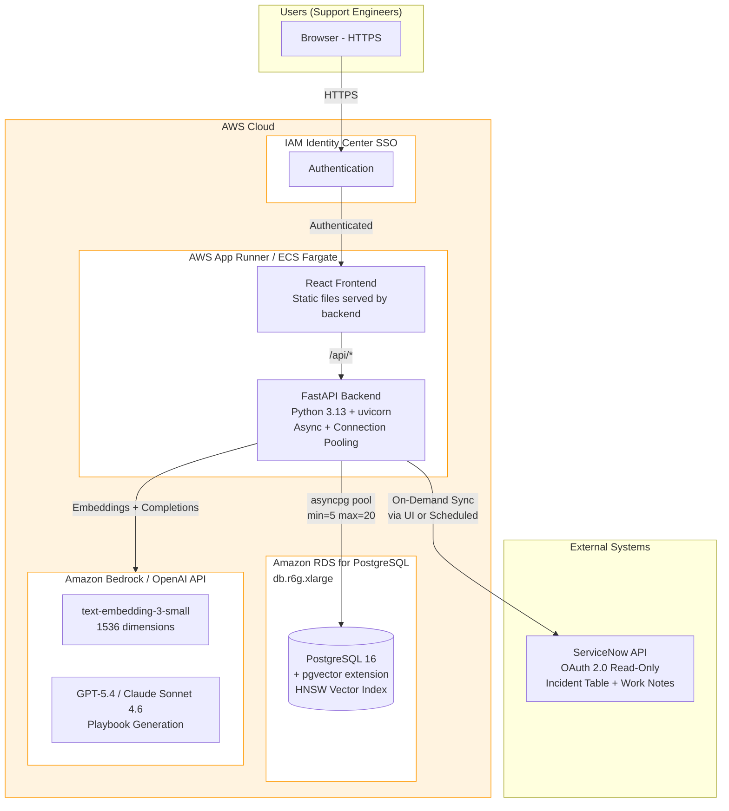
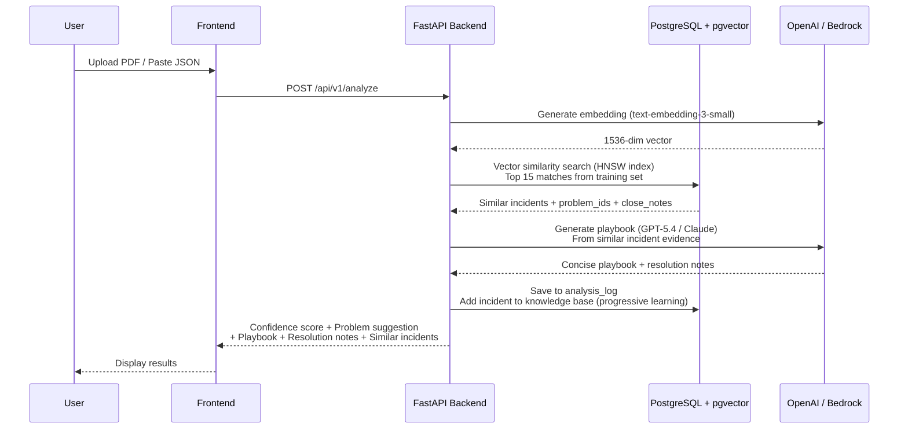
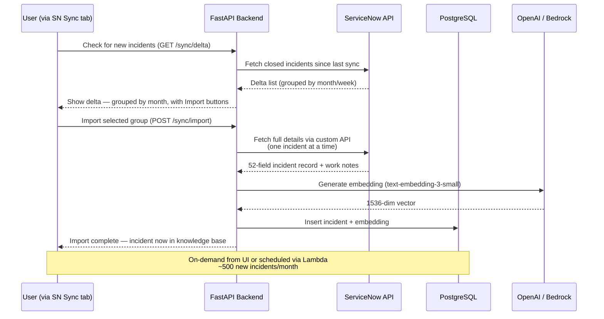
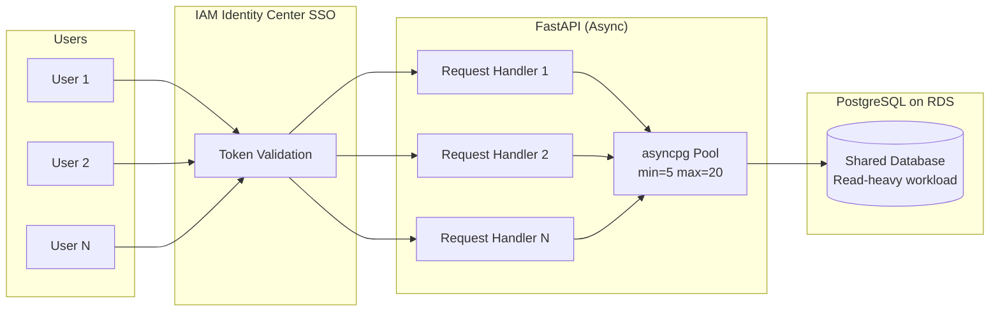

# REX-US — Production Deployment Architecture & Requirements (AWS)

## 1. System Architecture

## 2. Data Flow — Incident Analysis

## 3. Data Flow — Incident Sync

Users can sync new incidents from ServiceNow directly from the UI (SN Sync tab), or a scheduled job can run it automatically.

## 4. AWS Infrastructure Requirements

### Compute

| AWS Service | SKU / Tier | Specs | Purpose |
|-------------|-----------|-------|---------|
| **AWS App Runner** or **ECS Fargate** | 4 vCPU, 8 GB RAM | Auto-scaling | FastAPI backend + React frontend (single container) |
| **AWS Lambda** | Arm64, 512 MB | On-demand | Scheduled sync jobs |

> **Why no CloudFront/CDN?** REX-US is an internal tool behind SSO — there's no need for a global CDN. The React frontend is built as static files and served directly by the App Runner container alongside the API. This simplifies the architecture to a single compute service.

> **App Runner vs ECS Fargate:** App Runner is simpler (managed container hosting, auto-scaling, built-in load balancer). ECS Fargate gives more control (task definitions, service mesh, sidecar containers). For REX-US, App Runner is recommended for MVP; migrate to ECS if custom networking or sidecar requirements emerge.

### Database

| AWS Service | SKU / Tier | Specs | Purpose |
|-------------|-----------|-------|---------|
| **Amazon RDS for PostgreSQL** | db.r6g.xlarge | 4 vCPU, 32 GB RAM, 256 GB gp3 | pgvector + HNSW indexes |

> **Why r6g.xlarge?** The r6g (Graviton3, memory-optimized) instance class provides 32 GB RAM — enough to hold the HNSW index (~400 MB at 40K incidents) entirely in memory with substantial headroom. The gp3 storage tier provides 3,000 baseline IOPS at lower cost than io1.

**Database Sizing:**

| Metric | Current (Dev) | Production Estimate | Provisioned |
|--------|-------------|-------------------|-------------|
| Incidents | 18,236 | 40,000+ | Support up to 100,000 |
| DB size | 400 MB | ~2 GB at 40K incidents | **256 GB gp3 storage** |
| Vector index (HNSW) | 150 MB | ~400 MB at 40K | Fits in 32 GB RAM |
| Clusters | 2,379 | ~5,000 at 40K | ~200 MB |
| Analysis logs | Growing | ~10 GB/year | Included in 256 GB |
| Connection pool | 10 | 20 concurrent | RDS supports 100+ |
| **Clustering time** | ~5 min (15K) | ~12 min (40K) | Run during off-hours |
| **Embedding generation** | ~5 min (15K batch) | ~12 min (40K) | One-time + incremental |

### AI Services

REX-US supports multiple LLM providers through a pluggable architecture. The system can use any model available via OpenAI API or Amazon Bedrock.

| Service | Models Supported | Current Default | Purpose |
|---------|-----------------|----------------|---------|
| **OpenAI API** | GPT-5.4, GPT-5.3 | GPT-5.4 | Playbook generation, resolution notes |
| **OpenAI API** | text-embedding-3-small, text-embedding-3-large | text-embedding-3-small | Vector embedding generation (1536 dims) |
| **Amazon Bedrock** | Claude Opus 4.6, Claude Sonnet 4.6 | Sonnet 4.6 (preferred) | Alternative LLM for playbook generation |

> **Model flexibility**: The backend is model-agnostic — switching between GPT and Claude requires only a configuration change, not code changes. Amazon Bedrock provides access to Claude models without managing API keys directly, using IAM roles instead.

**API Usage Estimates:**

| Scenario | LLM Calls/day | Tokens/day |
|---------|---------------|-----------|
| Normal (10 analyses/day) | 30 | 40,000 |
| Heavy (50 analyses/day) | 150 | 200,000 |
| Initial load (40K incidents) | 400 batches | 600,000 |
| Monthly re-sync (500 new) | 5 batches | 10,000 |

### Networking & Security

| AWS Service | Purpose |
|-------------|---------|
| **ALB (Application Load Balancer)** | HTTPS termination, routes traffic to App Runner / ECS |
| **AWS WAF** (optional) | Web application firewall (rate limiting, IP filtering) — attach to ALB |
| **AWS Secrets Manager** | API key storage (OpenAI, ServiceNow) |
| **AWS IAM Identity Center (SSO)** | SSO authentication — all users authenticate before reaching the app |
| **Amazon CloudWatch** | Logging, metrics, alerts, dashboards |
| **AWS VPC** | Private networking for RDS + App Runner |

## 5. Access Requirements Checklist

### What We Need Before Deployment

| # | Access Required | Purpose | Owner | Status |
|---|----------------|---------|-------|--------|
| 1 | **AWS Account** | Host all services | IT / Cloud Team | ⬜ |
| 2 | **AWS VPC + Subnets** | Private networking for RDS | Cloud Admin | ⬜ |
| 3 | **OpenAI API key** or **Bedrock model access** | GPT-5.4 + text-embedding-3-small | AI/ML Team | ⬜ |
| 4 | **AWS IAM Identity Center** | SSO for user authentication | Identity Team | ⬜ |
| 5 | **Amazon RDS for PostgreSQL** | With pgvector extension enabled | DBA Team | ⬜ |
| 6 | **ServiceNow API credentials** | OAuth 2.0 client_id + secret (read-only) | ServiceNow Admin | ⬜ |
| 7 | **Route 53 DNS record** | e.g., rexus.discounttire.com | Networking Team | ⬜ |
| 8 | **ACM SSL certificate** | Managed via AWS Certificate Manager | Security Team | ⬜ |
| 9 | **GitHub Actions / CodePipeline** | CI/CD pipeline for deployments | DevOps Team | ⬜ |

### Secrets (stored in AWS Secrets Manager)

| Secret | Type | Used By |
|--------|------|---------|
| `OPENAI_API_KEY` | API Key | Backend → OpenAI (embeddings + GPT-5.4) |
| `OPENAI_API_ENDPOINT` | URL | Backend → OpenAI (or Bedrock endpoint) |
| `SERVICENOW_CLIENT_ID` | OAuth 2.0 | Backend → ServiceNow incident sync |
| `SERVICENOW_CLIENT_SECRET` | OAuth 2.0 | Backend → ServiceNow incident sync |
| `DATABASE_URL` | Connection string | Backend → PostgreSQL |
| `SSO_CLIENT_ID` | OAuth 2.0 | Frontend → IAM Identity Center SSO |

## 6. API Reference

All endpoints are available via OpenAPI/Swagger at `/docs` when the backend is running.

### Core Analysis

| Method | Endpoint | Auth | Description |
|--------|----------|------|-------------|
| `POST` | `/api/v1/analyze` | Bearer | Analyze incident from ServiceNow JSON. Returns confidence, playbook, problem suggestion, similar incidents. |
| `POST` | `/api/v1/analyze/text` | Bearer | Quick analysis from plain text description. |
| `POST` | `/api/v1/parse-pdf` | Bearer | Upload ServiceNow PDF → extract structured JSON. |

### Incidents & Knowledge Base

| Method | Endpoint | Auth | Description |
|--------|----------|------|-------------|
| `GET` | `/api/v1/incidents` | Bearer | List/filter/search incidents. Supports: `page`, `page_size`, `category`, `cmdb_ci`, `search`. |
| `GET` | `/api/v1/incidents/{number}` | Bearer | Full incident detail with cluster info. |
| `GET` | `/api/v1/clusters` | Bearer | List incident clusters. Supports: `min_size`, `sort_by`. |
| `GET` | `/api/v1/clusters/{id}` | Bearer | Cluster detail with top incidents and playbook. |
| `GET` | `/api/v1/playbooks` | Bearer | List generated playbooks. |
| `GET` | `/api/v1/search?q={query}` | Bearer | Vector similarity search. Supports: `limit`, `threshold`. |

### Analytics & Monitoring

| Method | Endpoint | Auth | Description |
|--------|----------|------|-------------|
| `GET` | `/api/v1/analytics` | Bearer | Dashboard stats: incident counts, categories, clusters, resolution times. |
| `GET` | `/api/v1/analysis-log` | Bearer | List all past analyses with results. |
| `GET` | `/api/v1/analysis-log/{id}` | Bearer | Full detail of a specific analysis. |
| `GET` | `/health` | None | Health check: DB connectivity, incident count. |

### Feedback

| Method | Endpoint | Auth | Description |
|--------|----------|------|-------------|
| `POST` | `/api/v1/feedback` | Bearer | Submit text feedback linked to an analysis. |
| `GET` | `/api/v1/feedback` | Bearer | List all feedback entries. |

### Quality Testing (Internal)

| Method | Endpoint | Auth | Description |
|--------|----------|------|-------------|
| `GET` | `/api/v1/waves` | Bearer | List test waves with counts. |
| `GET` | `/api/v1/waves/{wave}/incidents` | Bearer | List incidents in a test wave. |
| `GET` | `/api/v1/waves/{wave}/test/{inc}` | Bearer | Get test incident split into input + actual. |

## 7. Multi-User Architecture (10+ concurrent users)

### How Concurrent Users Are Handled

| Concern | How It's Addressed |
|---------|-------------------|
| **Session conflicts** | None — each API call is stateless. No server-side sessions. |
| **Concurrent uploads** | Each request gets its own DB connection from the async pool. No blocking. |
| **Database contention** | PostgreSQL handles concurrent reads efficiently. Writes (analysis logs) use row-level locking. |
| **LLM rate limits** | OpenAI default: 120K tokens/min. 10 concurrent analyses = ~40K tokens. Well within limits. |
| **User identification** | IAM Identity Center SSO provides user identity. Every analysis tagged with `user_id`. |
| **Connection pool** | `min_size=5, max_size=20` — supports up to 20 concurrent DB operations. |

## 8. MVP vs Roadmap

### MVP (Production Deploy)

| Feature | Status | Notes |
|---------|--------|-------|
| Incident analysis (PDF + JSON upload) | ✅ Built | Core feature |
| Vector similarity search (pgvector HNSW) | ✅ Built | 15K incidents embedded |
| Problem suggestion (weighted scoring) | ✅ Built | 82% group-aware accuracy |
| Playbook generation (GPT-5.4) | ✅ Built | Cluster-influenced, incident-specific |
| Resolution notes (detailed evidence) | ✅ Built | Separate from playbook |
| Incident browser with filters | ✅ Built | Category, system, search |
| Cluster explorer | ✅ Built | 2,379 clusters |
| Dashboard analytics | ✅ Built | Categories, systems, resolution times |
| Text feedback submission | ✅ Built | Linked to analysis ID |
| Analysis logging | ✅ Built | Every analysis saved |
| Progressive learning | ✅ Built | New incidents added to knowledge base |
| SSO authentication | 🔲 Needed | IAM Identity Center or Cognito |
| API authentication (Bearer tokens) | 🔲 Needed | Before production |
| ServiceNow production API access | 🔲 Needed | Currently using dev instance |

### Roadmap (Post-MVP, Customer-Funded)

| Phase | Features | Value |
|-------|----------|-------|
| **Phase 1: Voice & AI Chat** | Voice feedback transcription (Whisper), Conversational AI assistant for incident diagnosis | Hands-free feedback, faster triage |
| **Phase 2: Auto-Tagging** | Auto-suggest problem + assignment group when incident is created in ServiceNow, ServiceNow integration (write-back) | Reduce manual tagging, faster routing |
| **Phase 3: Predictive Analytics** | Predict resolution time from similar incidents, SLA breach prediction, Trend detection (emerging patterns) | Proactive operations |
| **Phase 4: Knowledge Base** | Confluence/JIRA integration, Auto-generate KB articles from playbooks, Link incidents to KB articles | Self-service resolution |
| **Phase 5: Continuous Learning** | Automated model retraining on new incidents, Feedback loop (user corrections improve suggestions), A/B testing of algorithm changes | System gets smarter over time |
| **Phase 6: Multi-Tenant** | Support multiple teams/organizations, Role-based access control, Custom models per team | Enterprise scale |

---

## 9. AWS vs Azure Service Mapping

| Capability | Azure | AWS (this document) |
|-----------|-------|---------------------|
| Backend compute | App Service B3 | App Runner / ECS Fargate |
| Frontend hosting | Static Web Apps | Served from App Runner container (no CDN needed — internal app behind SSO) |
| Scheduled jobs | Azure Functions | Lambda |
| Database | Azure DB for PostgreSQL | Amazon RDS for PostgreSQL |
| LLM access | Azure OpenAI | OpenAI API / Amazon Bedrock |
| WAF (optional) | Azure Front Door | ALB + AWS WAF |
| Secrets | Azure Key Vault | AWS Secrets Manager |
| SSO | Azure AD | IAM Identity Center / Cognito |
| Monitoring | Azure Monitor | CloudWatch |
| SSL certificates | Azure Front Door managed | ACM (Certificate Manager) |
| DNS | External | Route 53 |
| CI/CD | Azure DevOps | GitHub Actions / CodePipeline |

---

## 10. Validation Results

Testing performed on 114+ incidents using chronological train/test split:

| Metric | Value |
|--------|-------|
| Training set | 15,000 incidents (2021-01 → 2025-03) |
| Test set | 3,236 incidents in 6 waves |
| **Group-aware accuracy** | **82%** |
| **Real miss rate** | **5%** (2 genuine misses in 114 tested) |
| **Average confidence** | **86%** |
| System suggests when team didn't tag | **54% of untagged incidents** |

Full testing log available in `docs/wave-testing-log.md`.

---

*Document version: 1.0 | Generated: 2026-03-30 | REX-US v2 — AWS Deployment Variant*
