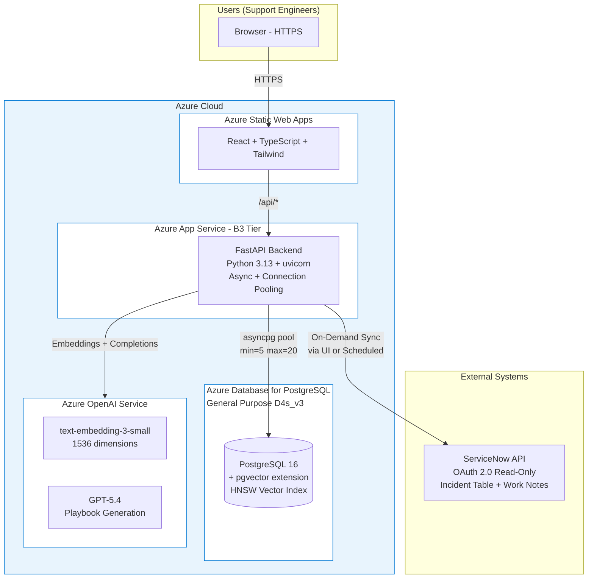
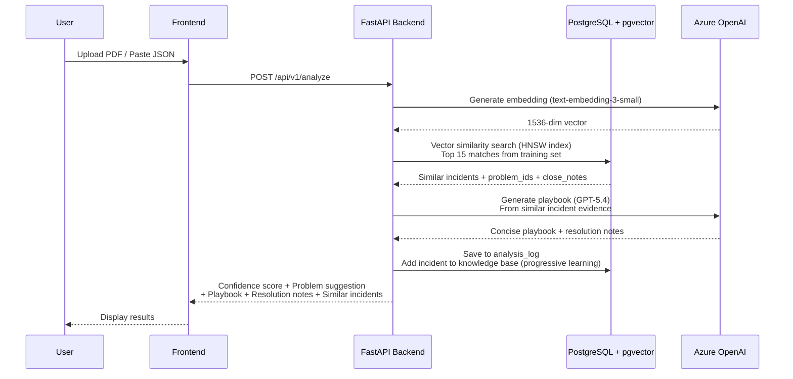
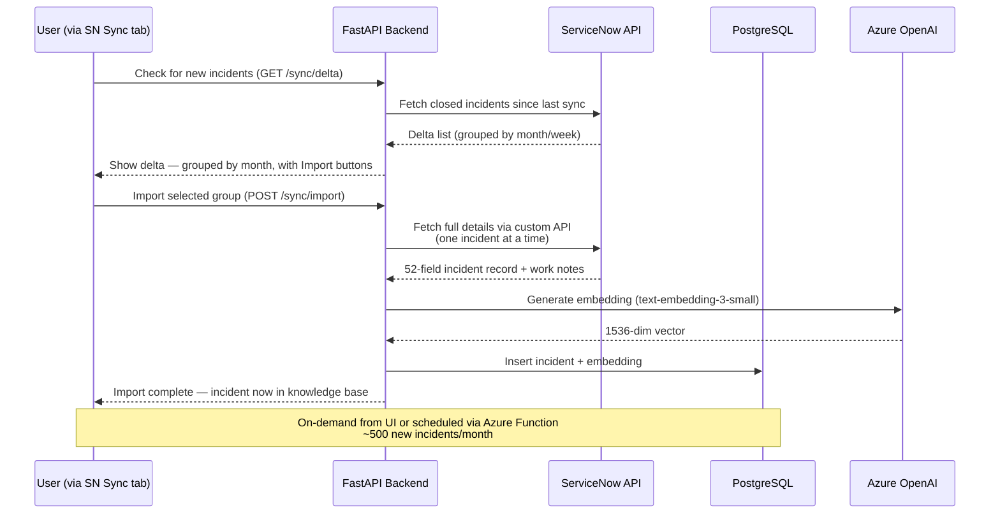
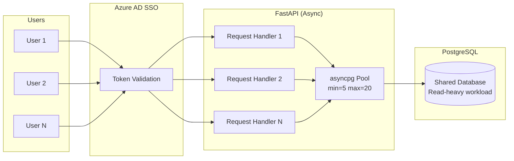

# REX-US — Production Deployment Architecture & Requirements

## 1. System Architecture

## 2. Data Flow — Incident Analysis

## 3. Data Flow — Incident Sync

Users can sync new incidents from ServiceNow directly from the UI (SN Sync tab), or a scheduled job can run it automatically.

## 4. Azure Infrastructure Requirements

### Compute

| Azure Service | SKU / Tier | Specs | Purpose |
|--------------|-----------|-------|---------|
| **Azure App Service** | B3 (Basic) | 4 vCPU, 8 GB RAM | FastAPI backend |
| **Azure Static Web Apps** | Standard | Global CDN | React frontend |
| **Azure Functions** | Consumption | On-demand | Scheduled sync jobs |

### Database

| Azure Service | SKU / Tier | Specs | Purpose |
|--------------|-----------|-------|---------|
| **Azure Database for PostgreSQL** | General Purpose D4s_v3 | 4 vCPU, 16 GB RAM, 256 GB storage | pgvector + HNSW indexes |

**Database Sizing:**

| Metric | Current (Dev) | Production Estimate | Provisioned |
|--------|-------------|-------------------|-------------|
| Incidents | 18,236 | 40,000+ | Support up to 100,000 |
| DB size | 400 MB | ~2 GB at 40K incidents | **256 GB storage** |
| Vector index (HNSW) | 150 MB | ~400 MB at 40K | Fits in 16 GB RAM |
| Clusters | 2,379 | ~5,000 at 40K | ~200 MB |
| Analysis logs | Growing | ~10 GB/year | Included in 256 GB |
| Connection pool | 10 | 20 concurrent | D4s supports 100 |
| **Clustering time** | ~5 min (15K) | ~12 min (40K) | Run during off-hours |
| **Embedding generation** | ~5 min (15K batch) | ~12 min (40K) | One-time + incremental |

### AI Services

REX-US supports multiple LLM providers through a pluggable architecture controlled by the `LLM_PROVIDER` environment variable:

| Deployment | `LLM_PROVIDER` | Chat Model | Embedding Model | Auth |
|-----------|----------------|------------|-----------------|------|
| **Azure** | `openai` | GPT-5.4 via Azure OpenAI | text-embedding-3-small (1536 dims) | Azure OpenAI API Key |
| **AWS** | `bedrock` | Claude Opus 4.6 via Bedrock | Cohere Embed v4 (1536 dims) | IAM Role (no API key) |
| **Local Dev** | `openai` | gpt-4o | text-embedding-3-small (1536 dims) | OpenAI API Key |

> **Model flexibility**: The backend is model-agnostic -- switching between providers requires only configuration changes (`LLM_PROVIDER`, `LLM_CHAT_MODEL`, `LLM_EMBED_MODEL`), not code changes. Both embedding paths produce 1536-dimensional vectors, so the pgvector index works identically across environments. For the AWS deployment path using Bedrock, no OpenAI API key is needed -- see `deployment-architecture-aws.md`.

**API Usage Estimates:**

| Scenario | OpenAI Calls/day | Tokens/day |
|---------|-----------------|-----------|
| Normal (10 analyses/day) | 30 | 40,000 |
| Heavy (50 analyses/day) | 150 | 200,000 |
| Initial load (40K incidents) | 400 batches | 600,000 |
| Monthly re-sync (500 new) | 5 batches | 10,000 |

### Networking & Security

| Azure Service | Purpose |
|--------------|---------|
| **Azure Front Door** | HTTPS termination, WAF, CDN |
| **Azure Key Vault** | API key storage (OpenAI, ServiceNow) |
| **Azure AD** | SSO authentication for users (included in M365) |
| **Azure Monitor** | Logging, metrics, alerts |

## 5. Access Requirements Checklist

### What We Need Before Deployment

| # | Access Required | Purpose | Owner | Status |
|---|----------------|---------|-------|--------|
| 1 | **Azure Subscription** | Host all services | IT / Cloud Team | ⬜ |
| 2 | **Azure Resource Group** | REX-US resource isolation | Cloud Admin | ⬜ |
| 3 | **Azure OpenAI access** | GPT-5.4 + text-embedding-3-small | AI/ML Team | ⬜ |
| 4 | **Azure AD App Registration** | SSO for user authentication | Identity Team | ⬜ |
| 5 | **Azure DB for PostgreSQL** | Flexible Server with pgvector extension | DBA Team | ⬜ |
| 6 | **ServiceNow API credentials** | OAuth 2.0 client_id + secret (read-only) | ServiceNow Admin | ⬜ |
| 7 | **DNS record** | e.g., rexus.discounttire.com | Networking Team | ⬜ |
| 8 | **SSL certificate** | Managed via Azure Front Door | Security Team | ⬜ |
| 9 | **Azure DevOps / GitHub** | CI/CD pipeline for deployments | DevOps Team | ⬜ |

### API Keys & Secrets (stored in Azure Key Vault)

| Secret | Type | Used By |
|--------|------|---------|
| `AZURE_OPENAI_KEY` | API Key | Backend → Azure OpenAI (embeddings + GPT-5.4) |
| `AZURE_OPENAI_ENDPOINT` | URL | Backend → Azure OpenAI |
| `REXUS_JWT_SECRET` | Secret key | Backend → JWT token signing/verification |
| `REXUS_ADMIN_PASSWORD` | Password | Backend → default admin account creation on first run |
| `SERVICENOW_CLIENT_ID` | OAuth 2.0 | Backend → ServiceNow incident sync |
| `SERVICENOW_CLIENT_SECRET` | OAuth 2.0 | Backend → ServiceNow incident sync |
| `DATABASE_URL` | Connection string | Backend → PostgreSQL |
| `AZURE_AD_CLIENT_ID` | OAuth 2.0 | Frontend → Azure AD SSO (network-level auth) |

## 6. API Reference

All endpoints are available via OpenAPI/Swagger at `/docs` when the backend is running.

### Authentication

| Method | Endpoint | Auth | Description |
|--------|----------|------|-------------|
| `POST` | `/auth/login` | None | Login with username/password. Returns JWT access token. |
| `POST` | `/auth/change-password` | Bearer | Change current user's password. |
| `GET` | `/auth/me` | Bearer | Get current user profile. |
| `GET` | `/auth/users` | Bearer (admin) | List all users (admin only). |
| `POST` | `/auth/users` | Bearer (admin) | Create a new user (admin only). |
| `PUT` | `/auth/users/{id}` | Bearer (admin) | Update user role/status (admin only). |
| `DELETE` | `/auth/users/{id}` | Bearer (admin) | Delete a user (admin only). |

### Core Analysis

| Method | Endpoint | Auth | Description |
|--------|----------|------|-------------|
| `POST` | `/api/v1/analyze` | Bearer | Analyze incident from ServiceNow JSON. Returns confidence, playbook, problem suggestion, similar incidents. |
| `POST` | `/api/v1/analyze/text` | Bearer | Quick analysis from plain text description. |
| `POST` | `/api/v1/analyze/incident/{number}` | Bearer | Fetch incident from ServiceNow and analyze in one call. |
| `POST` | `/api/v1/parse-pdf` | Bearer | Upload ServiceNow PDF → extract structured JSON. |
| `GET` | `/api/v1/fetch-incident/{number}` | Bearer | Fetch a single incident from ServiceNow by INC number. |

### Incidents & Knowledge Base

| Method | Endpoint | Auth | Description |
|--------|----------|------|-------------|
| `GET` | `/api/v1/incidents` | Bearer | List/filter/search incidents. Supports: `page`, `page_size`, `category`, `cmdb_ci`, `search`. |
| `GET` | `/api/v1/incidents/{number}` | Bearer | Full incident detail with work notes, cluster info. |
| `GET` | `/api/v1/clusters` | Bearer | List incident clusters. Supports: `min_size`, `sort_by`. |
| `GET` | `/api/v1/clusters/{id}` | Bearer | Cluster detail with top incidents and playbook. |
| `GET` | `/api/v1/playbooks` | Bearer | List generated playbooks. |
| `GET` | `/api/v1/search?q={query}` | Bearer | Vector similarity search. Supports: `limit`, `threshold`. |

### Analytics & Monitoring

| Method | Endpoint | Auth | Description |
|--------|----------|------|-------------|
| `GET` | `/api/v1/analytics` | Bearer | Dashboard stats: incident counts, categories, clusters, resolution times. |
| `GET` | `/api/v1/analysis-log` | Bearer | List all past analyses with results. |
| `GET` | `/api/v1/analysis-log/{id}` | Bearer | Full detail of a specific analysis. |
| `GET` | `/api/v1/token-usage` | Bearer | Token usage dashboard — cost by model, endpoint, daily trend. |
| `GET` | `/api/v1/config/llm` | Bearer | Current LLM provider configuration. |
| `GET` | `/health` | None | Simple liveness check for load balancer probes. |
| `GET` | `/health/detailed` | None (or `REXUS_ADMIN_KEY`) | Full 7-check observability: DB, LLM, ServiceNow, pool stats, usage, uptime. |

### Feedback

| Method | Endpoint | Auth | Description |
|--------|----------|------|-------------|
| `POST` | `/api/v1/feedback` | Bearer | Submit text feedback linked to an analysis. |
| `GET` | `/api/v1/feedback` | Bearer | List all feedback entries. |

### Quality Testing (Internal)

| Method | Endpoint | Auth | Description |
|--------|----------|------|-------------|
| `GET` | `/api/v1/waves` | Bearer | List test waves with counts. |
| `GET` | `/api/v1/waves/{wave}/incidents` | Bearer | List incidents in a test wave. |
| `GET` | `/api/v1/waves/{wave}/test/{inc}` | Bearer | Get test incident split into input + actual. |

## 7. Multi-User Architecture (10+ concurrent users)

### How Concurrent Users Are Handled

| Concern | How It's Addressed |
|---------|-------------------|
| **Session conflicts** | None — each API call is stateless. No server-side sessions. |
| **Concurrent uploads** | Each request gets its own DB connection from the async pool. No blocking. |
| **Database contention** | PostgreSQL handles concurrent reads efficiently. Writes (analysis logs) use row-level locking. |
| **OpenAI rate limits** | Azure OpenAI default: 120K tokens/min. 10 concurrent analyses = ~40K tokens. Well within limits. |
| **User identification** | Azure AD SSO provides user identity. Every analysis tagged with `user_id`. |
| **Connection pool** | `min_size=5, max_size=20` — supports up to 20 concurrent DB operations. |

## 8. MVP vs Roadmap

### MVP (Production Deploy)

| Feature | Status | Notes |
|---------|--------|-------|
| Incident analysis (PDF + JSON upload) | ✅ Built | Core feature |
| Vector similarity search (pgvector HNSW) | ✅ Built | 15K incidents embedded |
| Problem suggestion (weighted scoring) | ✅ Built | 82% group-aware accuracy |
| Playbook generation (GPT-5.4) | ✅ Built | Cluster-influenced, incident-specific |
| Resolution notes (detailed evidence) | ✅ Built | Separate from playbook |
| Incident browser with filters | ✅ Built | Category, system, search |
| Cluster explorer | ✅ Built | 2,379 clusters |
| Dashboard analytics | ✅ Built | Categories, systems, resolution times |
| Text feedback submission | ✅ Built | Linked to analysis ID |
| Analysis logging | ✅ Built | Every analysis saved |
| Progressive learning | ✅ Built | New incidents added to knowledge base |
| JWT authentication (login + roles) | ✅ Built | Admin/analyst/viewer roles, bcrypt + PyJWT |
| API authentication (Bearer tokens) | ✅ Built | All endpoints protected with JWT Bearer tokens |
| Token usage tracking | ✅ Built | Cost monitoring per model, endpoint, daily trend |
| INC number fetch + analyze | ✅ Built | Fetch from ServiceNow and analyze in one call |
| Azure AD SSO | 🔲 Needed | Network-level authentication before production |
| ServiceNow production API access | 🔲 Needed | Currently using dev instance |

### Roadmap (Post-MVP, Customer-Funded)

| Phase | Features | Value |
|-------|----------|-------|
| **Phase 1: Voice & AI Chat** | Voice feedback transcription (Whisper), Conversational AI assistant for incident diagnosis | Hands-free feedback, faster triage |
| **Phase 2: Auto-Tagging** | Auto-suggest problem + assignment group when incident is created in ServiceNow, ServiceNow integration (write-back) | Reduce manual tagging, faster routing |
| **Phase 3: Predictive Analytics** | Predict resolution time from similar incidents, SLA breach prediction, Trend detection (emerging patterns) | Proactive operations |
| **Phase 4: Knowledge Base** | Confluence/JIRA integration, Auto-generate KB articles from playbooks, Link incidents to KB articles | Self-service resolution |
| **Phase 5: Continuous Learning** | Automated model retraining on new incidents, Feedback loop (user corrections improve suggestions), A/B testing of algorithm changes | System gets smarter over time |
| **Phase 6: Multi-Tenant** | Support multiple teams/organizations, Role-based access control, Custom models per team | Enterprise scale |

---

## 9. Validation Results

Testing performed on 114+ incidents using chronological train/test split:

| Metric | Value |
|--------|-------|
| Training set | 15,000 incidents (2021-01 → 2025-03) |
| Test set | 3,236 incidents in 6 waves |
| **Group-aware accuracy** | **82%** |
| **Real miss rate** | **5%** (2 genuine misses in 114 tested) |
| **Average confidence** | **86%** |
| System suggests when team didn't tag | **54% of untagged incidents** |

Full testing log available in `docs/wave-testing-log.md`.

---

*Document version: 2.0 | Updated: 2026-04-07 | REX-US v8 — Enterprise Deployment (Azure + JWT Auth)*
