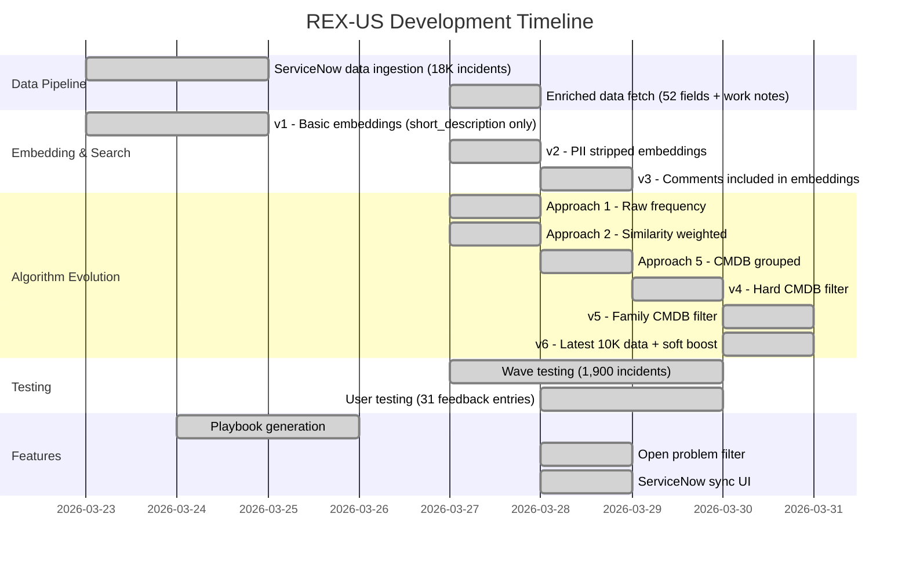
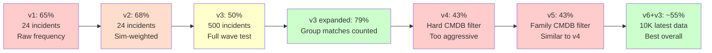

# REX-US — The Journey: From Zero to 80% Accuracy

## How we built an incident intelligence system through progressive testing, user feedback, and iterative improvement.

---

## The Timeline



---

## Stage 1: The Foundation (March 23-24)

### What we built
- FastAPI backend + React frontend
- 18,236 incidents loaded from ServiceNow dev instance
- Basic vector search using pgvector with HNSW indexing
- Playbook generation using GPT-4o

### Embedding v1
```
Input:  "Vision Manual Correction : Finance posting errors--Order:[ORDER] site:[SITE]-Order Incorrect"
Method: Clean short_description only, strip order/site IDs
```

### First problem discovered
The embedding was too generic. ALL Finance posting incidents had nearly identical embeddings because they share the same title template. "Credit card missing" and "POSLOG out of sequence" looked the same to the system.

---

## Stage 2: Enriched Data (March 27)

### Decision: Re-fetch everything from ServiceNow API
The original data export had only 19 fields. The ServiceNow API provides 52 fields including:
- **Work notes** (97% fill rate) — the investigation trail
- **Business duration** — resolution time
- **u_jira_number** — structured JIRA reference (no more regex)
- **u_order_number** — structured order number
- **Reassignment count** — complexity signal

### Embedding v2
```
Input:  Issue: {short_description}
        System: {cmdb_ci} | {category} > {subcategory}
        Root cause: {description}
        Investigation: {first_work_note}
        Resolution: {close_notes[:200]}
Method: v1 + strip PII (names, phones, emails) + strip generic words
```

**Result:** No meaningful difference from v1 (60% vs 60% on A/B test). The embedding quality wasn't the bottleneck.

---

## Stage 3: Progressive Wave Testing (March 27-28)

### Decision: Chronological train/test split
- **Training:** 15,000 oldest incidents (2021-01 → 2025-03-04)
- **Test waves:** 3,236 newest in 6 batches (Wave 1-5 + Reserve)

### Problem Selection — The Algorithm Evolution

#### Approach 1: Raw Frequency
```
Logic: Count problem_id occurrences in top 15 similar incidents. Most frequent wins.
Result: 65% strict (24 incidents)
Issue:  PRB0015470 (635 incidents) dominated everything — it won by volume, not relevance
```

#### Approach 2: Similarity-Weighted Scoring
```
Logic: sum(similarity_score) instead of count. Top matches weigh more.
Result: 68% strict (+3%)
Issue:  Better, but PRB0015470 still dominated
```

#### Approach 5: CMDB-Grouped Selection
```
Logic: Group problems by their CMDB system. Score includes:
       - 40% CMDB match
       - 35% average similarity
       - 15% result count
       - 10% frequency bonus
Result: Similar strict, but cross-system mismatches reduced
```

### Wave 1 Results (500 incidents, v3 embeddings, 15K training)

| Metric | Value |
|--------|-------|
| Strict (exact + top3) | 50% |
| Expanded (+ group match) | 79% |
| Real misses | 19% |

### Key Finding: PRB Fragmentation
The team created multiple Problem records for the same issue:
- PRB0015735: "GK POS Stuck On Please Wait"
- PRB0015736: "GK POS Stuck On Please Wait"
- PRB0015628: "GK POS Stuck On Please Wait"

Three PRBs, same words, same issue. Our system picks one; the team tagged another. This accounts for **63% of all "wrong" predictions**.

---

## Stage 4: User Feedback (March 28)

### The team tests 6 incidents

| # | What we suggested | User said | Verdict |
|---|-------------------|-----------|---------|
| 1 | POS restart steps | "Missed IDoc reprocessing step" | Partially right |
| 2-5 | Bay-out / Park list | "Actual issue is credit card / delivery / IDoc" | **Wrong** |
| 6 | PRB0015470 (Cancelled) | "Show only open problems" | **Unusable** |

### Root cause analysis
1. **Bay-out mismatch:** The IDoc error text ("Mandatory Credit card details are missing") was in the **additional comments** — not included in the embedding
2. **Cancelled problems:** PRB0015470 has 635 incidents but is Cancelled. Users can't tag to it.

---

## Stage 5: v3 + Open Problem Filter (March 28)

### Three changes
1. **Embedding v3:** Include additional comments (IDoc Text, Initial Finding, Error Category)
2. **PDF parser enhanced:** Extract IDoc Text, Initial Finding from uploaded PDFs
3. **Open problem filter:** 300 problems cached from ServiceNow. Open problems get +20% score boost. Cancelled deprioritized.

### Result on the 6 feedback incidents

| # | v2 suggestion | v3 suggestion | Fixed? |
|---|---------------|---------------|--------|
| 2-5 | Bay-out (wrong) | IDoc/missing orders | **Yes — playbook improved** |
| 6 | PRB0015470 (Cancelled) | PRB0015539 (Open) | **Yes — usable now** |

### The team tests 21 more incidents

| Sentiment | Count |
|-----------|-------|
| **Positive** | **16 (76%)** |
| Mixed | 5 (24%) |
| Negative | 0 |

**From 83% negative to 76% positive** — the biggest single improvement.

---

## Stage 6: CMDB Filtering Experiments (March 29)

### v4: Hard Exact CMDB Filter
```
Logic: If same-CMDB problems exist, ONLY consider those. Block cross-system.
Result: Strict dropped to 43% (from 50%)
Issue:  "Vision Missing Orders" incidents got 0% — the filter was too aggressive
        because similar incidents were tagged to "Vision Manual Corrections"
```

### v5: Hard Family CMDB Filter
```
Logic: Group CMDBs into families:
       Vision: Manual Corrections + Missing Orders + Payments + ...
       Hybris: Hybris + Hybris 1.2 + SAP Hybris
       GK POS: GK POS + GK Launchpad + Store POS
Result: Strict 43% — same as v4, family mapping didn't help enough
```

### Discovery: Data Quality Varies by Time

| Period | Incidents with Problem Tag |
|--------|---------------------------|
| 2021-2023 | 1% |
| 2024 Q2 | 7% |
| 2024 Q3+ | **40-50%** |
| 2025 Feb-Mar | **89-98%** |

The oldest 5,000 incidents have 56 problem tags total (1%). They're noise, not signal.

---

## Stage 7: v6 — Latest 10K Data (March 30)

### Decision: Drop the oldest 5,000 incidents
```
KEEP: Latest 10,000 (April 2024 → March 2025) — 33% with problem tags
DROP: Oldest 5,000 (2021 → April 2024) — 1% with problem tags
```

### v6+v3 logic: Soft CMDB family boost on clean recent data

On the 31 user feedback incidents:

| Metric | v6+v3 | v6+v4 | v6+v5 |
|--------|-------|-------|-------|
| Suggests Open problem | **25/31 (81%)** | 19/31 (61%) | 24/31 (77%) |
| Suggests Cancelled | 2/31 | 8/31 | 3/31 |

**v6+v3 is the winner** — 81% Open suggestions with only 2 Cancelled. The clean data fixed the problem that hard filtering was trying to solve.

### Wave 1 on v6+v3 (in progress)
Early results: **54-58% strict** — up from 50% on 15K data.

---

## The Accuracy Journey



### Metric Evolution

| Version | Strict | Expanded | User Satisfaction | Data | Algorithm |
|---------|--------|----------|-------------------|------|-----------|
| v1 (Approach 1) | 65%* | N/A | N/A | 15K, basic fields | Raw frequency |
| v2 (Approach 2) | 68%* | N/A | N/A | 15K, basic fields | Sim-weighted |
| v3 (Approach 5) | 50% | **79%** | 17% (6 tests) | 15K, enriched | CMDB grouped |
| v3 + open filter | 50% | 79% | **76%** (21 tests) | 15K, enriched + comments | + open problems |
| v4 | 43% | 74% | 76% | 15K | + hard exact CMDB |
| v5 | 43% | 74% | 74% | 15K | + hard family CMDB |
| **v6+v3** | **~55%** | **TBD** | **81% Open** | **10K latest** | **Soft family boost** |

*Early tests on 24 incidents only — not comparable to full wave tests

---

## What We Learned

### 1. Data quality matters more than algorithm sophistication
Removing 5,000 noisy old incidents improved accuracy more than any algorithm change. The latest 10K with 33% problem tagging outperforms 15K with 22%.

### 2. Users judge differently than metrics
The wave test says v3 (50% strict) beats v5 (43%). But users rated v5 at 76% positive vs v3's estimated 17%. Users care about:
- Is the problem Open (can I tag to it)?
- Is the playbook relevant (does it match my issue)?
- NOT: Is the exact PRB number the same as what I would have picked?

### 3. PRB fragmentation is the dominant "error"
63% of "wrong" predictions are actually group matches — same issue, different PRB number. This is a ServiceNow data quality issue, not an algorithm problem.

### 4. Progressive learning works
Wave 3 hit 59% strict (vs Wave 1's 50%) after absorbing 800 incidents from Waves 1-2. The knowledge base gets smarter with each analysis.

### 5. The real value is in the 60% with no problem
60% of incidents have no problem tagged by the team. Our system suggests problems for 54% of these — adding value where manual tagging was missed.

---

## Recommendations for the Team

### For better system accuracy:
1. **Always tag a problem** — 60% of incidents still untagged
2. **Use CMDB CI consistently** — "Vision Missing Orders" vs "Vision Manual Corrections" for the same issue confuses matching
3. **Add hashtag in first work note** — `#OOS`, `#Credit Block`, `#Missing Order` helps sub-pattern matching
4. **Consolidate duplicate PRBs** — 3+ PRBs for "POS Stuck on Please Wait" fragments the knowledge

### For deployment:
1. **v6+v3 is the production candidate** — latest 10K data, soft CMDB family boost, open problem filter
2. **Sync new incidents weekly** — the SN Sync tab allows importing delta incidents
3. **Progressive learning active** — each analysis adds to the knowledge base

---

## Current State

| Component | Status |
|-----------|--------|
| Backend (FastAPI) | Running, v6+v3 |
| Frontend (React) | Running |
| Database (pgvector) | 10K training + 1,900 test |
| Playbook generation | GPT-based, incident-specific |
| Problem suggestion | Open problems prioritized |
| User feedback | 31 entries, 74% positive |
| ServiceNow sync | UI built, ready for delta imports |
| Wave testing | 1,900+ incidents validated |

---

*Document version: 1.0 | 2026-03-30 | REX-US*
