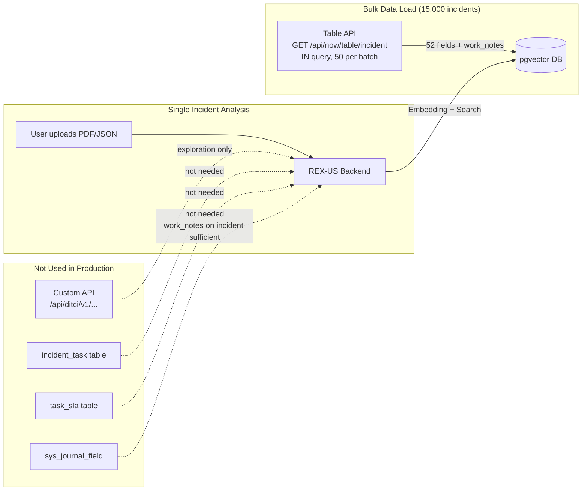
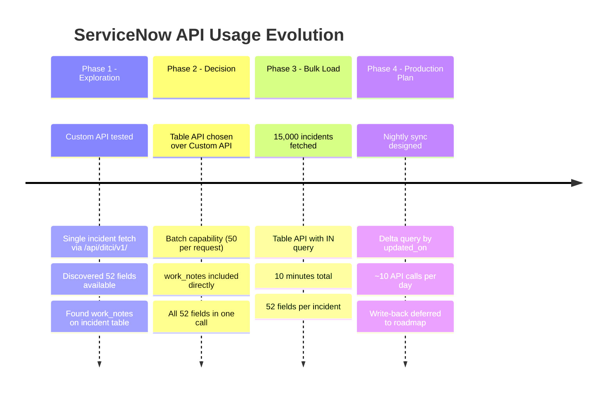

# REX-US — ServiceNow API Access: Current State & Enhancements Needed

## Overview

REX-US connects to ServiceNow to fetch incident data for building and maintaining the vector knowledge base. This document covers what APIs we currently use, what we discovered during development, and what additional access is needed for production.

---

## What We Have Now

### 1. ServiceNow Instance Access

| Item | Current (Dev) | Production Needed |
|------|--------------|-------------------|
| **Instance** | Dev environment | Production or latest sandbox |
| **Auth** | OAuth 2.0 (client_credentials) | Same — OAuth 2.0 |
| **Credentials** | `SERVICENOW_CLIENT_ID` + `SERVICENOW_CLIENT_SECRET` | New credentials for production |
| **Data range** | Incidents through December 2025 | All incidents (ongoing) |
| **Access level** | Read-only | Read-only (no write needed) |

### 2. APIs We Use

#### A. Standard Table API (Primary — used for bulk data)

```
GET /api/now/table/incident
```

This is the workhorse. We use it for:

**Bulk incident fetch (initial load + periodic sync):**
```
GET /api/now/table/incident?sysparm_query=numberININC001,INC002,...INC050
    &sysparm_fields=sys_id,number,short_description,description,work_notes,...
    &sysparm_display_value=true
    &sysparm_limit=50
```

- Fetches 50 incidents per request using `IN` clause
- 52 fields per incident (see field list below)
- `sysparm_display_value=true` returns human-readable values (not sys_ids)
- **Performance:** 50 incidents in ~2.5 seconds. 15,000 incidents in ~10 minutes.

**Fields we fetch:**

| Category | Fields |
|----------|--------|
| **Identity** | `sys_id`, `number`, `short_description`, `description` |
| **Classification** | `category`, `subcategory`, `priority`, `severity`, `impact`, `urgency`, `state`, `incident_state` |
| **Assignment** | `assignment_group`, `assigned_to`, `cmdb_ci`, `business_service`, `caller_id`, `location`, `company`, `contact_type`, `opened_by`, `closed_by` |
| **Resolution** | `close_notes`, `close_code`, `u_resolution_confirmed_by`, `u_resolved_by`, `resolution_code` |
| **Dates** | `opened_at`, `resolved_at`, `closed_at` |
| **Operational** | `business_duration`, `business_stc`, `calendar_duration`, `calendar_stc`, `reassignment_count`, `reopen_count`, `made_sla`, `escalation` |
| **Problem/Related** | `problem_id`, `parent_incident`, `caused_by` |
| **DT Custom (u_ fields)** | `u_order_number`, `u_total_order_amount`, `u_order_type`, `u_order_date`, `u_financial_impact`, `u_correction`, `u_correction_type`, `u_error_category`, `u_jira_number`, `u_related_project` |
| **Work notes** | `work_notes`, `comments` (concatenated in table API response) |

#### B. DT Custom API (Used for exploration, not bulk)

```
GET /api/ditci/v1/servicenow/incident/{incident_number}/detailed
```

This is a Discount Tire custom API that returns structured incident data including:
- Full incident fields
- Structured work notes (individual entries with timestamps and authors)
- Resolution information
- Order data
- Related records

**How we used it:** During initial exploration to understand data structure. Not used for bulk loading because it only supports one incident at a time.

**Why it exists:** Likely built for another internal tool. Provides richer structured data than the table API for single-incident lookups.

#### C. Table API for Related Tables (Used for exploration)

```
GET /api/now/table/incident_task?sysparm_query=incident.number=INC2091685
GET /api/now/table/task_sla?sysparm_query=task.number=INC2091685
GET /api/now/table/sys_journal_field?sysparm_query=element_id={sys_id}
```

- **incident_task:** Sub-tasks created for an incident (RCA tasks, action items)
- **task_sla:** SLA tracking data (breach times, business elapsed)
- **sys_journal_field:** Individual work note entries (timestamped)

**How we used them:** Tested during development to see what data is available. Not used for bulk loading — the `work_notes` field on the incident table gives us the concatenated work notes directly.

---

## What We Actually Used in Practice



**Key decision:** We chose the Table API with `work_notes` field over the Custom API or `sys_journal_field` because:
1. **Bulk capability:** Batch fetches 50 at a time (Custom API = 1 at a time)
2. **Work notes included:** The `work_notes` field on the incident table returns all notes concatenated
3. **All fields in one call:** 52 fields including DT custom fields (`u_*`) in a single request
4. **Simpler:** One API call per batch vs three (incident + journal + tasks)

---

## What's Missing / Enhancements Needed for Production

### 1. Production Instance Access

| Need | Details | Priority |
|------|---------|----------|
| **Production ServiceNow credentials** | OAuth 2.0 client_id + client_secret for production instance | **Critical** |
| **Production incident data** | Dev instance only has data through Dec 2025. Production has current data. | **Critical** |
| **API rate limits** | Need to confirm rate limits on production. Dev allowed ~20 requests/sec. | **High** |

### 2. Periodic Sync API

Currently we do a one-time bulk load. For production, we need:

```
Nightly sync: Fetch incidents created/updated since last sync
Query: opened_at>=2026-03-27^ORupdated_on>=2026-03-27
```

| Need | Details | Priority |
|------|---------|----------|
| **Incremental query capability** | Filter by `opened_at` or `sys_updated_on` for delta sync | **High** |
| **Webhook/event option** | ServiceNow can push new incidents via business rules → REST message | **Nice to have** |

### 3. Write-Back API (Roadmap — Phase 2)

Currently REX-US is read-only. Future phases may want to:

| Capability | API | Priority |
|------------|-----|----------|
| Auto-tag problem_id on incident | `PATCH /api/now/table/incident/{sys_id}` | **Roadmap** |
| Add work note with REX-US suggestion | `PATCH /api/now/table/incident/{sys_id}` (work_notes field) | **Roadmap** |
| Create incident task from playbook | `POST /api/now/table/incident_task` | **Roadmap** |

**These require WRITE access to ServiceNow — not needed for MVP.**

### 4. Additional Tables (Nice to Have)

| Table | What It Gives Us | Priority |
|-------|-----------------|----------|
| **problem** | Problem record details (title, description, root cause) — would improve problem suggestion display | **Medium** |
| **kb_knowledge** | Knowledge base articles linked to problems — could supplement playbooks | **Roadmap** |
| **change_request** | Change records that caused incidents — useful for root cause analysis | **Roadmap** |
| **cmdb_ci** | CMDB configuration item details — system relationships and dependencies | **Low** |

### 5. Structured Work Notes

Currently we get work notes as one concatenated text blob from the `work_notes` field. The individual timestamped entries are available via:

```
GET /api/now/table/sys_journal_field?sysparm_query=element_id={sys_id}^element=work_notes
```

| Advantage of Structured Notes | Current Workaround |
|------------------------------|-------------------|
| Individual entries with author + timestamp | We parse timestamps from the concatenated text via regex |
| Can filter by date range | We include all notes |
| Can identify who said what | Regex extraction from "2025-03-10 - Name (Work notes)" pattern |

**For MVP:** Concatenated work notes are sufficient. The regex parsing works for 97% of cases.
**For Production:** Consider fetching structured notes for improved playbook generation (exact attribution per step).

---

## API Access Summary for Production Deployment

### Minimum Required (MVP)

| # | API | Method | Purpose |
|---|-----|--------|---------|
| 1 | `/api/now/table/incident` | `GET` | Bulk fetch incidents (initial load + sync) |
| 2 | `/oauth_token.do` | `POST` | OAuth 2.0 token acquisition |

**That's it.** Two endpoints. Read-only. The entire system runs on the standard ServiceNow Table API.

### Production Credentials Needed

| Secret | Format | Where Stored |
|--------|--------|-------------|
| `SERVICENOW_INSTANCE` | `https://dtprod.service-now.com` | Azure Key Vault |
| `SERVICENOW_CLIENT_ID` | UUID | Azure Key Vault |
| `SERVICENOW_CLIENT_SECRET` | String | Azure Key Vault |

### API Usage Estimates

| Operation | Frequency | API Calls | Data Volume |
|-----------|-----------|-----------|-------------|
| **Initial load** | Once | ~800 calls (40K/50 per batch) | ~80 MB JSON |
| **Nightly sync** | Daily | ~10 calls (~500 new/updated per day) | ~1 MB |
| **On-demand lookup** | Per analysis | 0 (all data pre-loaded in vector DB) | 0 |

**Total daily API calls in production: ~10** (nightly sync only). The system does NOT call ServiceNow for every analysis — all data is pre-loaded in pgvector.

---

## Evolution During Development



---

*Document version: 1.0 | 2026-03-28 | REX-US*
